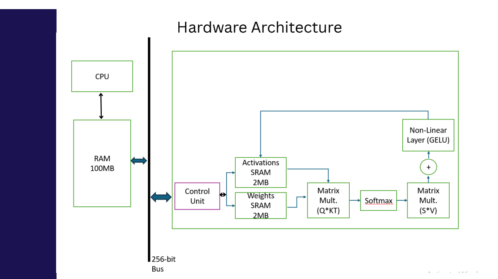
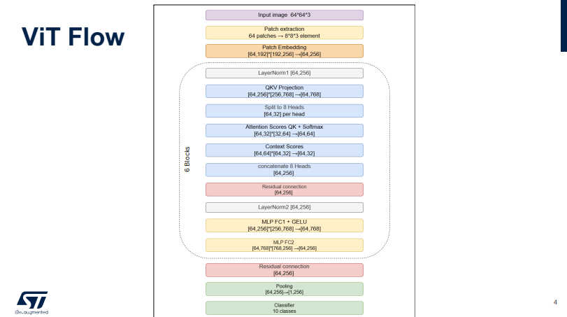
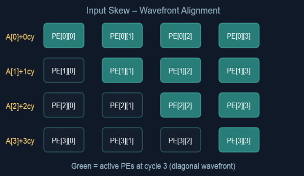

# Vision Transformer (ViT) Hardware Accelerator

##  Overview
This project presents a complete pipeline for implementing a Vision Transformer (ViT) accelerator, starting from software modeling and training to hardware RTL implementation and verification.

The system demonstrates how transformer-based vision models can be efficiently mapped to hardware using quantization, optimized dataflow, and dedicated compute units.

---

##  Software Modeling

The ViT model was first implemented and trained using Python (PyTorch) on CIFAR-10.

### Features:
- Data preprocessing and augmentation
- ViT architecture implementation
- Training and evaluation pipeline
- Accuracy validation

### Outputs:
- Trained model weights (`.pth`)
- Quantized parameters
- Exported `.mem` files for hardware inference

---

##  Quantization & Hardware Preparation

To enable efficient hardware execution:

- Weights and activations → **INT8**
- Accumulation → **INT32**
- Scaling implemented using **dyadic approximation**


out = (input × m) >> s


### Benefits:
- Eliminates floating-point operations
- Reduces memory footprint
- Improves performance

---

##  Hardware Architecture
### System-Level Architecture


> Figure: High-level hardware architecture of the ViT accelerator.

The hardware accelerator is composed of:

### 1. Memory System
- External DRAM (inputs, weights, outputs)
- On-chip SRAM:
  - Weight SRAM
  - Activation SRAM
- Intermediate buffers (Q, K, V, attention, MLP)

### 2. Compute Core
- Systolic Array-based Matrix Multiplication Unit (MMU)
- Processing Elements (PEs)
- K-tiling for large matrices

### 3. Non-Linear Units
- Softmax (LUT-based)
- GELU activation
- Layer Normalization

### 4. Control Unit
- FSM-based controller
- Handles data movement and pipeline execution

---

##  Dataflow Pipeline
### ViT Processing Flow


> Figure: End-to-end Vision Transformer processing pipeline from input image to classification.

1. Input image → INT8 quantization  
2. Patch embedding  
3. Transformer blocks (×6):
   - LayerNorm  
   - QKV Projection  
   - Multi-Head Attention  
   - Softmax  
   - Projection + Residual  
   - MLP (FC1 → GELU → FC2)  
4. Final LayerNorm  
5. Classification Head  

Matrix operations:

INT8 × INT8 → INT32 → Requantization → INT8


---

##  RTL Implementation
### Matrix Multiplication Unit (MMU)


> Figure: Wavefront-based systolic array architecture used for efficient matrix multiplication.

### Implemented Modules:
- `mmu_modular_complete.sv` → Matrix multiplication (Systolic Array)
- `softmax_pipelined.sv` → Softmax unit
- `softmax_lut_pkg.sv` → LUT support
- `gelu.sv` / `gelu_pipelined.sv` → Activation
- `layernorm_pipelined.sv` → Normalization
- `matrix_ping_pong_buffer.sv` → Full matrix buffering
- `dyadic_params.sv` → Quantization parameters
- `vit_top_integrated.sv` → Top-level integration

### Testbench:
- `vit_tb.sv` → Full system verification

---

## Verification & Results

- End-to-end RTL simulation completed
- Full pipeline validated using testbench
- Stable dataflow across all modules
- Achieved:
  - **18 / 20 correct predictions (~90% accuracy)**

---


##  Project Structure

```bash
├── rtl/
│   ├── mmu_modular_complete.sv
│   ├── softmax_pipelined.sv
│   ├── softmax_lut_pkg.sv
│   ├── gelu.sv
│   ├── gelu_pipelined.sv
│   ├── layernorm_pipelined.sv
│   ├── matrix_ping_pong_buffer.sv
│   ├── dyadic_params.sv
│   └── vit_top_integrated.sv
│
├── tb/
│   └── vit_tb.sv
│
├── modeling/
│   ├── vit-cifar-10-ver2.ipynb
│   ├── vit-cifar-10-ver3.ipynb
│   └── best_model.pth
│
└── README.md
```
---

##  Key Contributions

- Full ViT pipeline: **Software → Quantization → RTL**
- Efficient systolic array-based computation
- Hardware-friendly transformer implementation
- Optimized memory and buffering strategy
- End-to-end verification of inference pipeline

---

##  Future Work

- FPGA deployment and benchmarking
- Support for larger ViT models
- Mixed precision (INT8 + FP16)
- Throughput and latency optimization

---

## Author
Sondos Ahmed
